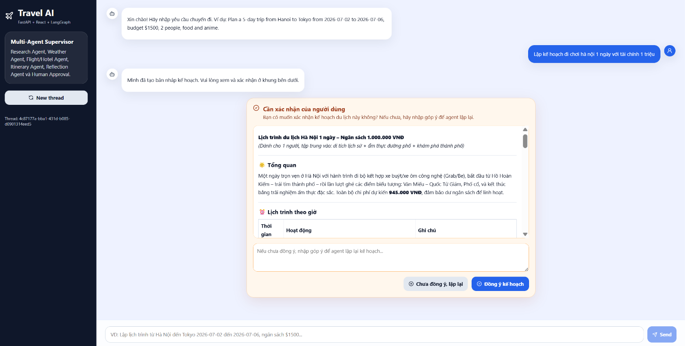
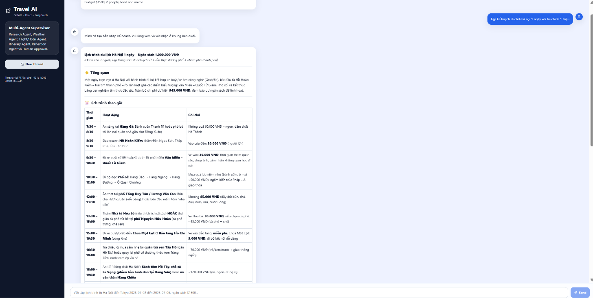
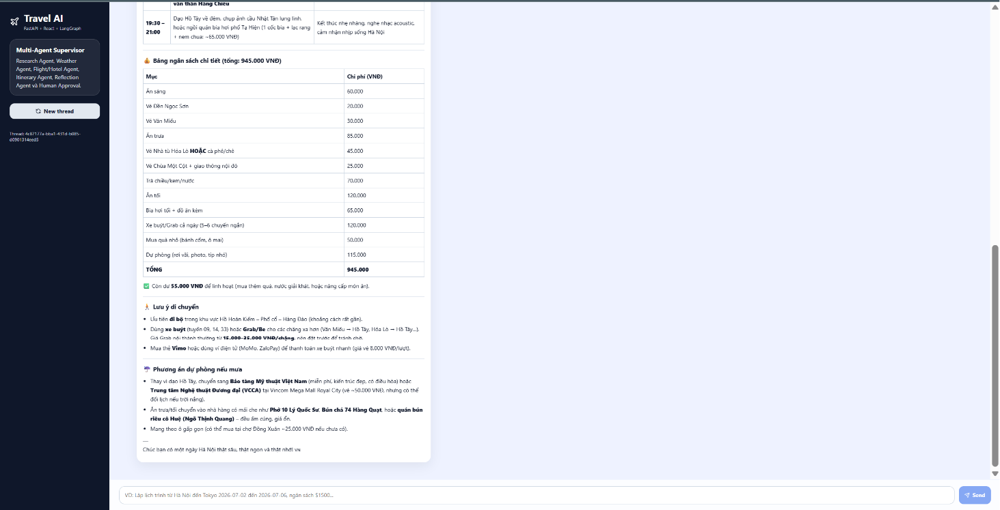

# Travel AI Assistant

Travel AI Assistant là một ứng dụng AI hỗ trợ lập lịch trình du lịch thông minh, được xây dựng bằng **FastAPI**, **React** và **LangGraph**. Hệ thống sử dụng kiến trúc **Multi-Agent Workflow** để phân tích yêu cầu người dùng, lập kế hoạch chuyến đi, kiểm tra ngân sách, đưa ra phương án dự phòng và cho phép người dùng xác nhận kế hoạch thông qua cơ chế **Human-in-the-loop Approval**.

Phiên bản hiện tại sử dụng **Alibaba Cloud Qwen API** thông qua OpenAI-compatible endpoint.

---

## Giao diện

### 1. Tạo lịch trình và yêu cầu người dùng xác nhận

Sau khi người dùng nhập yêu cầu:

> Lập kế hoạch đi chơi Hà Nội 1 ngày với tài chính 1 triệu

Hệ thống tạo bản nháp lịch trình và hiển thị khung xác nhận. Người dùng có thể chọn **Đồng ý kế hoạch** hoặc nhập góp ý để agent lập lại lịch trình.



---

### 2. Lịch trình được trình bày theo bảng rõ ràng

Kết quả trả về được render bằng Markdown, bao gồm phần tổng quan, lịch trình theo giờ, hoạt động cụ thể và ghi chú thực tế. Với yêu cầu đi chơi Hà Nội 1 ngày, hệ thống đề xuất các điểm như Hồ Gươm, Đền Ngọc Sơn, Văn Miếu, Phố cổ, Hồ Tây và các địa điểm ăn uống phù hợp ngân sách.



---

### 3. Bảng ngân sách và phương án dự phòng

Ngoài lịch trình, hệ thống còn tự động tạo bảng ngân sách chi tiết. Trong ví dụ này, tổng chi phí dự kiến là khoảng **945.000 VNĐ**, thấp hơn ngân sách người dùng đưa ra là **1.000.000 VNĐ**. Hệ thống cũng đưa ra lưu ý di chuyển và phương án dự phòng nếu thời tiết xấu.



---

## Tính năng chính

* Lập lịch trình du lịch tự động dựa trên yêu cầu tự nhiên của người dùng.
* Hỗ trợ lập kế hoạch theo ngân sách, thời gian, số người và sở thích.
* Kiến trúc Multi-Agent sử dụng LangGraph.
* Human-in-the-loop: người dùng có thể xác nhận hoặc yêu cầu chỉnh sửa kế hoạch.
* Frontend React hiển thị kết quả dạng Markdown đẹp và dễ đọc.
* Backend FastAPI cung cấp API `/api/chat` và `/api/chat/resume`.
* Lưu 3 đoạn chat gần nhất bằng `localStorage` trên trình duyệt.
* Có cơ chế fallback khi chưa cấu hình API phụ như thời tiết, khách sạn hoặc chuyến bay.
* Có thể chuyển đổi giữa nhiều nhà cung cấp LLM như Gemini hoặc Alibaba Cloud Qwen.

---

## Kiến trúc hệ thống

```txt
User
 ↓
React Frontend
 ↓
FastAPI Backend
 ↓
LangGraph Multi-Agent Workflow
 ├── Extract Preferences Agent
 ├── Research Agent
 ├── Weather Agent
 ├── Flight/Hotel Agent
 ├── Itinerary Agent
 ├── Reflection Agent
 ├── Human Approval Node
 └── Finalizer
 ↓
Qwen API / External APIs / Fallback Data
```

---

## Cấu trúc thư mục

```txt
travel-ai-assistant
├── backend
│   ├── app
│   │   ├── agents
│   │   │   ├── graph.py
│   │   │   └── llm.py
│   │   ├── core
│   │   │   └── config.py
│   │   ├── schemas
│   │   │   └── chat.py
│   │   └── main.py
│   ├── requirements.txt
│   ├── .env.example
│   └── test_qwen.py
│
├── frontend
│   ├── src
│   │   ├── App.jsx
│   │   ├── api.js
│   │   ├── main.jsx
│   │   └── styles.css
│   ├── package.json
│   └── vite.config.js
│
├── docs
│   └── images
│       ├── result-approval.png
│       ├── result-itinerary-table.png
│       └── result-budget-summary.png
│
├── docker-compose.yml
├── render.yaml
├── README.md
└── .gitignore
```

---

## Cài đặt backend

Di chuyển vào thư mục backend:

```powershell
cd backend
```

Tạo môi trường ảo:

```powershell
python -m venv .venv
```

Kích hoạt môi trường ảo:

```powershell
.venv\Scripts\activate
```

Cài đặt thư viện:

```powershell
python -m pip install -r requirements.txt
```

Tạo file `.env` từ file mẫu:

```powershell
copy .env.example .env
```


Mở Swagger API:

```txt
http://127.0.0.1:8000/docs
```

---

## Cài đặt frontend

Mở terminal mới và di chuyển vào thư mục frontend:

```powershell
cd frontend
```

Cài đặt thư viện:

```powershell
npm install
```

Chạy giao diện:

```powershell
npm run dev
```

Mở ứng dụng:

```txt
http://localhost:5173
```

---

## API chính

### 1. Tạo lịch trình

Endpoint:

```txt
POST /api/chat
```

Request body:

```json
{
  "message": "Lập kế hoạch đi chơi Hà Nội 1 ngày với tài chính 1 triệu",
  "thread_id": null
}
```

Response mẫu:

```json
{
  "status": "requires_approval",
  "thread_id": "example-thread-id",
  "answer": "Lịch trình du lịch Hà Nội 1 ngày...",
  "interrupt": {
    "type": "travel_plan_approval",
    "question": "Bạn có muốn xác nhận kế hoạch du lịch này không?",
    "itinerary": "..."
  }
}
```

---

### 2. Xác nhận hoặc gửi góp ý

Endpoint:

```txt
POST /api/chat/resume
```

Approve kế hoạch:

```json
{
  "thread_id": "example-thread-id",
  "approved": true,
  "feedback": ""
}
```

Gửi góp ý để agent lập lại:

```json
{
  "thread_id": "example-thread-id",
  "approved": false,
  "feedback": "Hãy giảm chi phí ăn uống và thêm nhiều địa điểm văn hóa hơn."
}
```

---

## Mô tả luồng hoạt động

1. Người dùng nhập yêu cầu du lịch bằng ngôn ngữ tự nhiên.
2. Backend nhận request và tạo `thread_id`.
3. LangGraph chạy qua các agent:

   * Trích xuất thông tin chuyến đi.
   * Thu thập dữ liệu tham khảo hoặc dùng fallback nếu thiếu API phụ.
   * Tạo lịch trình chi tiết bằng Qwen.
   * Kiểm tra logic ngân sách, thời gian và tính thực tế.
4. Hệ thống trả về bản nháp lịch trình.
5. Frontend hiển thị khung xác nhận.
6. Người dùng có thể:

   * Đồng ý kế hoạch.
   * Gửi feedback để agent lập lại.
7. Khi người dùng đồng ý, hệ thống trả về bản kế hoạch cuối cùng.

---


## Điểm nổi bật của project

Project không chỉ đơn giản là gọi API LLM, mà tập trung vào thiết kế workflow AI có kiểm soát:

* Có trạng thái hội thoại theo `thread_id`.
* Có bước xác nhận của người dùng trước khi hoàn tất.
* Có khả năng nhận feedback và lập lại kế hoạch.
* Có cơ chế fallback khi API phụ chưa được cấu hình.
* Có giao diện trực quan để demo như một sản phẩm hoàn chỉnh.
* Có thể mở rộng sang nhiều nhà cung cấp LLM khác nhau.

---
